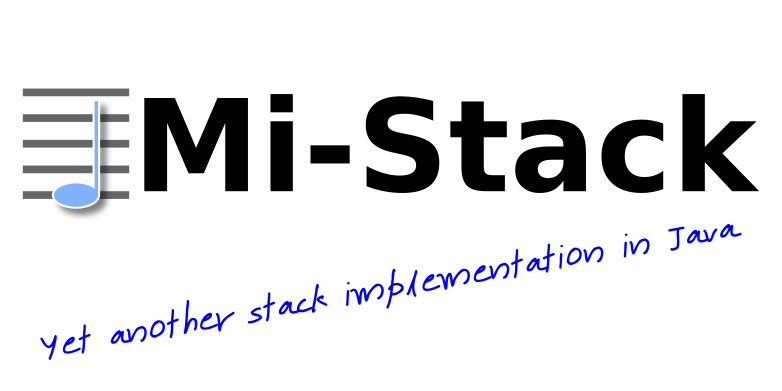

[](http://www.apache.org/licenses/LICENSE-2.0)
[](http://www.oracle.com/technetwork/java/javase/downloads/index.html)
[](http://search.maven.org/#artifactdetails|com.igormaznitsa|mi-stack|1.0.0|jar)
[](https://www.paypal.com/cgi-bin/webscr?cmd=_s-xclick&hosted_button_id=AHWJHJFBAWGL2)
[](https://yoomoney.ru/to/41001158080699)

# What is it?

Just abstract stack allows to mark its items by tags and get elements through either stream or iterator.

# IMplementations

## Thread safe

 - __MiStackConcurrent__, it uses as base _java.util.concurrent.ConcurrentLinkedDeque_.

## Thread unsafe

 - __MiStackArray__, based on dynamically growing array, also growing can be disabled and in the case it works with internal fixed size array. 
 - __MiStackArrayList__, based on java.util.ArrayList. 
 - __MiStackLinked__, it uses own internal implementation of linked list. 
 - __MiStackLinkedList__, based on java.util.LinkedList. 

## Abstract classes
 - __AbstractMiStackList__, it allows build MiStack implementation around a _java.util.List_ collection.

## Wrapper
 - __MiStackDeque__, it allows provide some _java.util.Deque_ collection to be used as base for MiStack

# Example

The example below shows minimal use case with pushing several tagged items on the stack and iteration through them with
predicated streams.

```java
    var tagStar = MiStackTagImpl.tagsOf("star");
    var tagPlanet = MiStackTagImpl.tagsOf("planet");
    var tagPlanetoid = MiStackTagImpl.tagsOf("planetoid");
    var tagAsteroid = MiStackTagImpl.tagsOf("asteroid");
    var tagSatellite = MiStackTagImpl.tagsOf("satellite");

    try (var stack = new MiStackArrayList<>()) {
      stack.push(MiStackItemImpl.itemOf("Sun", tagStar));
      stack.push(MiStackItemImpl.itemOf("Mercury", tagPlanet));
      stack.push(MiStackItemImpl.itemOf("Venus", tagPlanet, tagSatellite));
      stack.push(MiStackItemImpl.itemOf("Earth", tagPlanet, tagSatellite));
      stack.push(MiStackItemImpl.itemOf("Moon", tagPlanetoid, tagSatellite));
      stack.push(MiStackItemImpl.itemOf("Mars", tagPlanet));
      stack.push(MiStackItemImpl.itemOf("Phobos", tagAsteroid, tagSatellite));
      stack.push(MiStackItemImpl.itemOf("Demos", tagAsteroid, tagSatellite));
      stack.push(MiStackItemImpl.itemOf("Jupiter", tagPlanet));
      stack.push(MiStackItemImpl.itemOf("Saturn", tagPlanet));
      stack.push(MiStackItemImpl.itemOf("Uranus", tagPlanet));
      stack.push(MiStackItemImpl.itemOf("Neptune", tagPlanet));
      stack.push(MiStackItemImpl.itemOf("Pluto", tagPlanetoid));

      assertArrayEquals(new Object[] {"Sun"}, stack.stream(MiStack.allTags(tagStar)).map(MiStackItem::getValue).toArray());
      assertArrayEquals(new Object[] {"Pluto", "Moon"},stack.stream(MiStack.allTags(tagPlanetoid)).map(MiStackItem::getValue).toArray());
      assertArrayEquals(new Object[] {"Neptune", "Uranus", "Saturn", "Jupiter", "Mars", "Earth", "Venus","Mercury"}, stack.stream(MiStack.allTags(tagPlanet)).map(MiStackItem::getValue).toArray());
      assertArrayEquals(new Object[] {"Pluto", "Neptune", "Uranus", "Saturn", "Jupiter", "Mars", "Moon", "Earth","Venus", "Mercury"}, stack.stream(MiStack.anyTag(tagPlanet, tagPlanetoid)).map(MiStackItem::getValue).toArray());
    }
```